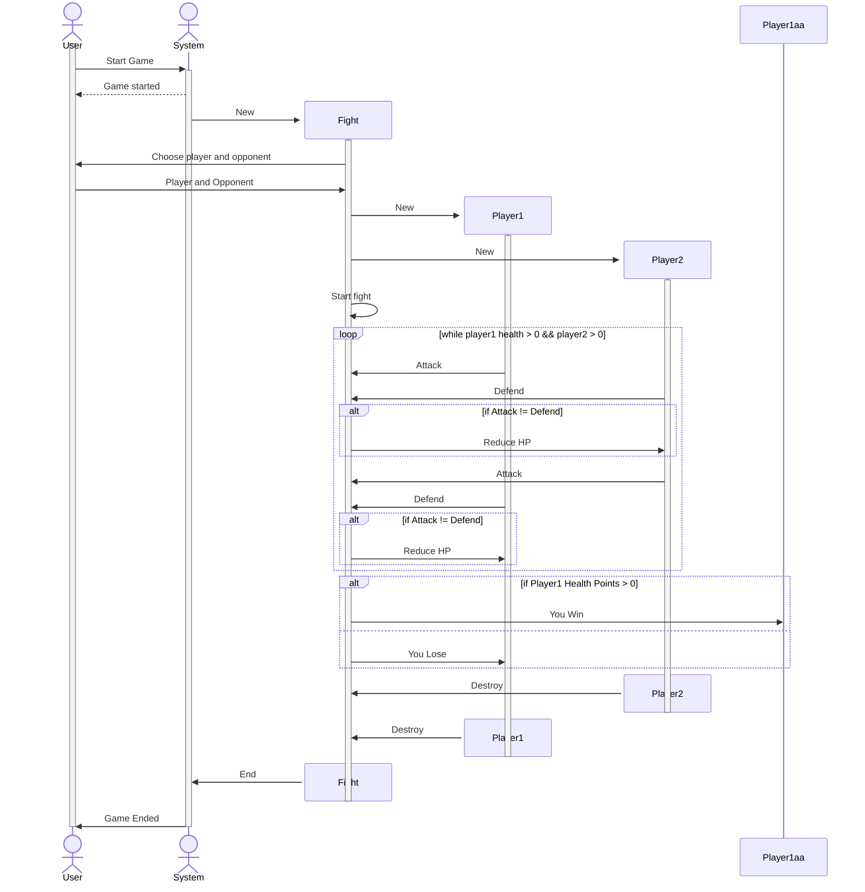

## Game - Sequence Diagram

```mermaid
sequenceDiagram
    actor User
    actor System

    activate User
    User ->>+System: Start Game
    System -->> User: Game started

    create participant Fight
    System ->>+ Fight: New
    Fight ->> User: Choose player and opponent
    User ->> Fight: Player and Opponent

    create participant Player1
    Fight ->>+ Player1: New

    create participant Player2
    Fight ->>+ Player2: New

    Fight ->> Fight: Start fight

    loop while player1 health > 0 && player2 > 0

    Player1 ->> Fight: Attack
    Player2->> Fight: Defend
    alt if Attack != Defend
    Fight ->> Player2: Reduce HP
    end

    Player2 ->> Fight: Attack
    Player1 ->> Fight: Defend
    alt if Attack != Defend
    Fight ->> Player1: Reduce HP
    end
    end

    alt if Player1 Health Points > 0
    Fight ->> Player1aa: You Win
    else
    Fight ->> Player1: You Lose
    end
    
    destroy Player2
    Player2 ->>- Fight: Destroy

    destroy Player1
    Player1 ->>- Fight: Destroy

    destroy Fight
    Fight ->>- System: End

    System ->>- User: Game Ended
    deactivate User
```
